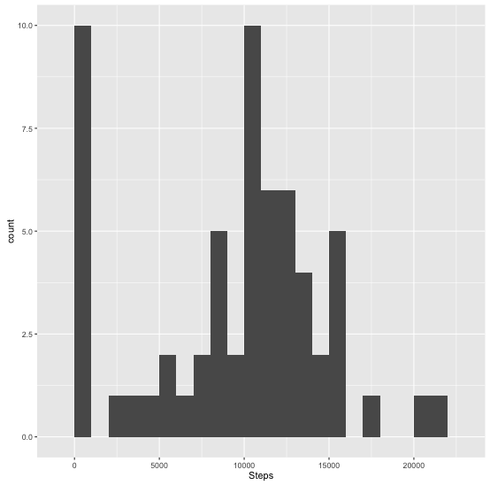

## Prerequisites
```{r}
library(ggplot2)
```
## Loading and preprocessing the data
```{r}
if(!file.exists('activity.csv')){
    unzip('activity.zip')
}
activity <- read.csv('activity.csv')
activity$date <- as.POSIXct(activity$date) 
```

## What is mean total number of steps taken per day?

### Calculate the total number of steps taken per day
```{r}
totalStepsByDay <- aggregate(activity$steps, by = list(activity$date), sum, na.rm=TRUE) 
names(totalStepsByDay) <- c("Date", "Steps")
```
### Make a histogram of the total number of steps taken each day
```{r}
ggplot(totalStepsByDay, aes(x = Steps)) +
            geom_histogram(binwidth = 1000)
```


### Calculate and report the mean and median of the total number of steps taken per day
```{r}
stepsMean <- mean(totalStepsByDay$Steps)
stepsMedian <- median(totalStepsByDay$Steps)
```

Mean of the total number of steps taken per day: 9354.23

Median of the total number of steps taken per day: 10395

## What is the average daily activity pattern?

### Make a time series plot of the 5-minute interval (x-axis) and the average number of steps taken, averaged across all days (y-axis)
```{r}
avgStepsByInterval <- aggregate(x= activity$steps, by=list(activity$interval), FUN=mean, na.rm=TRUE)
names(avgStepsByInterval) <- c("interval", "steps")
ggplot(avgStepsByInterval, aes(interval,steps)) +  geom_line()
```


### Which 5-minute interval, on average across all the days in the dataset, contains the maximum number of steps?
```{r}
maxStepsInterval <- avgStepsByInterval[which.max(avgStepsByInterval$steps), c("interval")]
maxStepsInterval
```
5-minute interval that contains max number of steps: 835

## Imputing missing values

### Calculate and report the total number of missing values in the dataset
```{r}
numNA <- length(which(is.na(activity$steps)))
numNA
```

Total number of missing values: 2304

### Create a new dataset that is equal to the original dataset but with the missing data filled in.
The strategy for imputing the dataset is to take average number of steps taken per interval and populate the missing values with it. 

```{r}
activityClean <- activity
activityClean$steps[is.na(activityClean$steps)] <- tapply(activityClean$steps, activityClean$interval, FUN = mean, na.rm = TRUE)
```
### Make a histogram of the total number of steps taken each day and Calculate and report the mean and median total number of steps taken per day.
```{r}
newSteps <- aggregate(x = activityClean$steps , by = list(activityClean$date), FUN = sum)
names(newSteps) <- c("Date", "Steps")
ggplot(newSteps, aes(x = Steps)) +
            geom_histogram(binwidth = 2000)
```

```{r}
newStepsMean <- mean(newSteps$Steps)
newStepsMedian <- median(newSteps$Steps)
newStepsMean
newStepsMedian
```
Mean: 10766.19
Median: 10766.19

## Are there differences in activity patterns between weekdays and weekends?

### Create a new factor variable in the dataset with two levels – “weekday” and “weekend” indicating whether a given date is a weekday or weekend day.
```{r}
activityClean$dateType <-  ifelse(as.POSIXlt(activityClean$date)$wday %in% c(0,6), 'weekend', 'weekday')
x <- aggregate(steps ~ interval + dateType, data=activityClean, mean)
```
### Make a panel plot containing a time series plot (i.e. 𝚝𝚢𝚙𝚎 = "𝚕") of the 5-minute interval (x-axis) and the average number of steps taken, averaged across all weekday days or weekend days (y-axis).
```{r}

ggplot(x, aes(interval, steps)) + 
    geom_line() + 
    facet_grid(dateType ~ .) +
    xlab("Interval") + 
    ylab("Average steps")
```    


